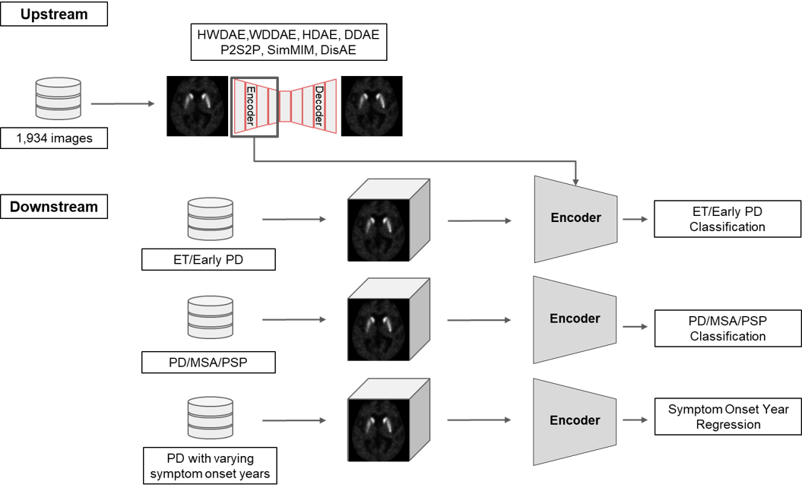

# PD_SSL_ZOO
This is the codebase for the paper "Self-Supervised Learning of 3D Dopamine Transporter Imaging using Diffusion Models as a Novel Biomarker for Parkinson’s Disease".

This repository composed of "1_UPSTREAM", "2_DOWNSTREAM", "3_RECONSTRUCTION", and "4_LATENT_MANIPULATION". 

Our overall workflow code parts are mainly in "1_UPSTREAM" and "2_DOWNSTREAM" illustrated below: 





For self-supervised pre-training, 

This repository is based on 
monai
lucidrain


## Traiing
- ahdrfef

```
python main.py --args
```

## Test
- abc