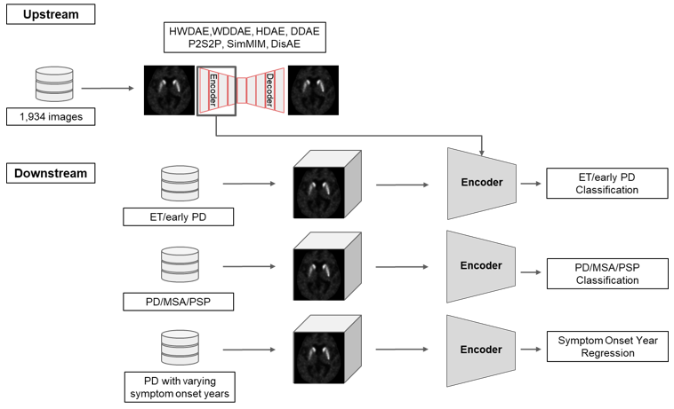

# PD_SSL_ZOO
This is the codebase for the paper "Self-Supervised Learning of 3D Dopamine Transporter Imaging using Diffusion Models as a Novel Biomarker for Parkinson’s Disease".

This repository composed of "1_UPSTREAM", "2_DOWNSTREAM", "3_RECONSTRUCTION", and "4_LATENT_MANIPULATION". 

Our overall workflow code parts are mainly in "1_UPSTREAM" and "2_DOWNSTREAM" illustrated below: 





This repository is based on other repositories of MONAI, lucidrains, and eladrich.

[Monai Generative Models](https://github.com/Project-MONAI/GenerativeModels/tree/main/generative) : HWDAE, WDDAE, DDAE, HDAE

[Monai/research-contribution (DisAE)](https://github.com/Project-MONAI/research-contributions/tree/main/DAE) : DisAE, SimMIM

[lucidrains/StyleGAN2-pytorch](https://github.com/lucidrains/stylegan2-pytorch) : StyleGAN2

[lucidrains/denoising_diffusion_pytorch](https://github.com/lucidrains/denoising-diffusion-pytorch/tree/main/denoising_diffusion_pytorch) : WDDAE, DDAE

[eladrich/Pixel2Style2Pixel](https://github.com/eladrich/pixel2style2pixel) : P2S2P

## Pretrained upstream model weights & synthetic samlpe scans
[One Drive/Weight](https://liveuou-my.sharepoint.com/my?id=%2Fpersonal%2Fkrying%5Fmail%5Fulsan%5Fac%5Fkr%2FDocuments%2FWEIGHTS)

[One Drive/Synthetic FP-CIT-PET Samples](https://liveuou-my.sharepoint.com/my?id=%2Fpersonal%2Fkrying%5Fmail%5Fulsan%5Fac%5Fkr%2FDocuments%2FSynth%5FFP%5FCIT%5FPET%5FSamples)


# Train & Test

There are directories for each upstream model and downstream task. 

Models : 1_HWDAE, 2_WDDAE, 3_DDAE, 4_P2S2P

Tasks : 1_EP, 2_PMP, 3_SOY 

Upstream: For the pre-training stage of SSL models.

```bash
python main.py --batch_size 2 --log_dir <log_dir>
```

Downstream: For the linear probing, training from scratch, or fine-tuning stages of downstream tasks from the upstream models.

```bash
python main.py --batch_size 2 --name <model_name> --log_dir <log_dir> --data_per <data_percentage> --linear_mode <linear | scratch | fine_tuning> 
```

Generation or Reconstruction:

```bash
python -m torch.distributed.launch --nproc_per_node=8 --master_port=11223 main.py
--batch_size=1 --num_steps=100000 --lrdecay --eval_num=500 --lr=6e-6 --decay=0.1
```